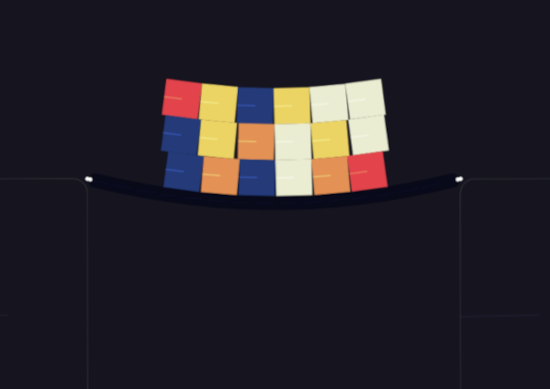
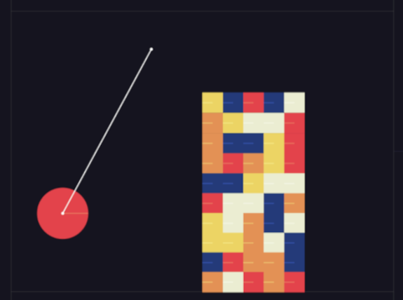
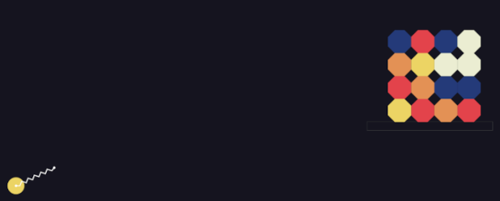
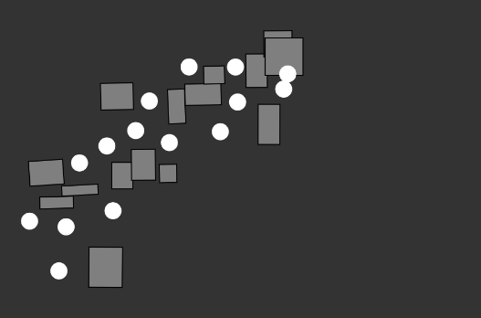

# Matter.Js Projects

Matter.js is a 2D physics engine for the web built in JavaScript

 

 

## matter.js Exeples:

 

#### The Bridge

 
 

#### Wrecking Ball

 
 

#### Slingshot

 
 

#### p5.js meets metter.js

 
 
 

> ### Sources and inspirations:

 

#### matter.js Official Website:

https://brm.io/matter-js/

 

##### p5.js Official Website:

https://p5js.org/

 

##### Introduction to matter.js on youtube:

https://www.youtube.com/watch?v=urR596FsU68

 

##### collection of nice examples:

https://codepen.io/collection/Fuagy/
